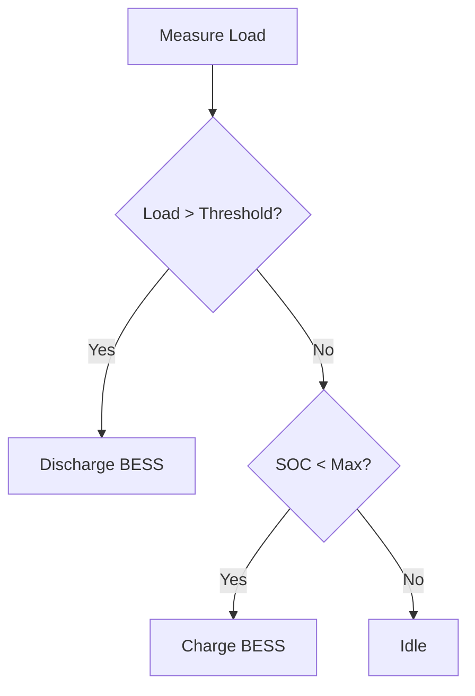

This post shows how to create flowcharts, sequence diagrams, and block diagrams for academic and engineering content.

---

## Energy Management System Flowchart

The following diagram shows the control logic of the rule-based EMS:

```
┌─────────────────────────────────────────────────┐
│          EMS Main Control Loop (5 min)          │
└──────────────────────┬──────────────────────────┘
                       │
                       ▼
            ┌──────────────────┐
            │  Read Sensors:   │
            │  P_load, P_PV,   │
            │  SOC, V_grid     │
            └────────┬─────────┘
                     │
                     ▼
            ┌──────────────────────────┐
            │  P_net = P_load - P_PV   │
            └────────┬─────────────────┘
                     │
          ┌──────────▼──────────┐
          │  P_net > Threshold?  │
          └──────┬───────┬──────┘
                YES      NO
                 │        │
                 ▼        ▼
       ┌──────────────┐  ┌────────────────────┐
       │ SOC > SOC_min│  │ SOC < SOC_max AND  │
       │    ?         │  │  P_net < Threshold │
       └──────┬───────┘  │    - 50 kW?        │
             YES          └────────┬───────────┘
              │                   YES
              ▼                    │
    ┌──────────────────┐           ▼
    │ Discharge BESS   │  ┌──────────────────┐
    │ P_cmd = min(     │  │  Charge BESS     │
    │  P_net-Thresh,   │  │  P_cmd = -min(   │
    │  P_max, SOC-lim) │  │   P_max, SOC-lim)│
    └──────────────────┘  └──────────────────┘
              │                    │
              └──────────┬─────────┘
                         ▼
              ┌───────────────────────┐
              │  Send Modbus Command  │
              │  to BESS Controller   │
              └───────────┬───────────┘
                          │
                          ▼
              ┌───────────────────────┐
              │  Log data to SCADA    │
              │  Update SOC estimate  │
              └───────────┬───────────┘
                          │
                          ▼
              ┌───────────────────────┐
              │  Wait 5 minutes       │◄──┐
              └───────────┬───────────┘   │
                          └───────────────┘
```

---

## DQN Training Algorithm

```
┌──────────────────────────────────────────────────┐
│           Deep Q-Network (DQN) Training          │
└──────────────────┬───────────────────────────────┘
                   │
        ┌──────────▼──────────┐
        │  Initialize:        │
        │  Q-network θ        │
        │  Target network θ'  │
        │  Replay buffer D    │
        └──────────┬──────────┘
                   │
        ┌──────────▼──────────┐
        │   Observe state s_t │◄─────────────────┐
        └──────────┬──────────┘                  │
                   │                             │
        ┌──────────▼──────────────────┐          │
        │  ε-greedy action selection: │          │
        │  Random action (prob ε)     │          │
        │  Greedy a = argmax Q(s,a;θ) │          │
        └──────────┬──────────────────┘          │
                   │                             │
        ┌──────────▼──────────┐                  │
        │ Execute action a_t  │                  │
        │ Observe r_t, s_{t+1}│                  │
        └──────────┬──────────┘                  │
                   │                             │
        ┌──────────▼──────────┐                  │
        │ Store (s,a,r,s') in │                  │
        │ replay buffer D     │                  │
        └──────────┬──────────┘                  │
                   │                             │
        ┌──────────▼──────────────────┐          │
        │ Sample mini-batch from D    │          │
        │ Compute target:             │          │
        │ y = r + γ max_a' Q(s',a';θ')│          │
        └──────────┬──────────────────┘          │
                   │                             │
        ┌──────────▼──────────────────┐          │
        │ Gradient descent step:       │          │
        │ Loss = E[(y - Q(s,a;θ))²]   │          │
        │ Update θ via Adam optimizer  │          │
        └──────────┬──────────────────┘          │
                   │                             │
        ┌──────────▼──────────┐                  │
        │ Every C steps:      │                  │
        │ θ' ← θ (hard update)│                  │
        └──────────┬──────────┘                  │
                   │                             │
        ┌──────────▼──────────────┐              │
        │  Converged?             │──── No ──────┘
        │  Episode done?          │
        └──────────┬──────────────┘
                  Yes
                   │
        ┌──────────▼──────────┐
        │  Save model weights  │
        │  Evaluate on test    │
        └─────────────────────┘
```

---

## HIL Testbed Architecture

```
┌─────────────────────────────────────────────────────────────────┐
│                   HILLTOP Testbed Architecture                  │
│              (Hardware-in-the-Loop Laboratory Platform)         │
└─────────────────────────────────────────────────────────────────┘

  ┌──────────────┐   Modbus TCP/IP    ┌───────────────────────┐
  │   SCADA /    │◄──────────────────►│  Typhoon HIL 606       │
  │  HMI Server  │                    │  (Real-time Simulator) │
  └──────┬───────┘                    └─────────┬──────────────┘
         │                                      │ Analog/Digital I/O
         │ IEC 61850                            │
         │                            ┌─────────▼──────────────┐
  ┌──────▼───────┐                    │  Power Hardware:        │
  │ EMS / Plant  │   Modbus TCP/IP    │  - BESS Inverter        │
  │  Controller  │◄──────────────────►│  - PV Emulator          │
  │  (Python/   │                    │  - Load Bank            │
  │   Simulink)  │                    │  - Grid Emulator        │
  └──────────────┘                    └─────────────────────────┘

  Communication Stack:
  ┌─────────────┐    ┌─────────────┐    ┌─────────────────┐
  │  Ethernet   │───►│  TCP/IP     │───►│  Modbus Layer   │
  │  (1 Gbps)   │    │  Socket     │    │  (FC 3, 6, 16)  │
  └─────────────┘    └─────────────┘    └─────────────────┘
```

---

## Tips for Diagrams in Jekyll

For proper rendered Mermaid diagrams (if you install the jekyll-mermaid plugin):

```liquid



```

ASCII art flowcharts (as shown above) work without any plugin and render perfectly in any browser.
